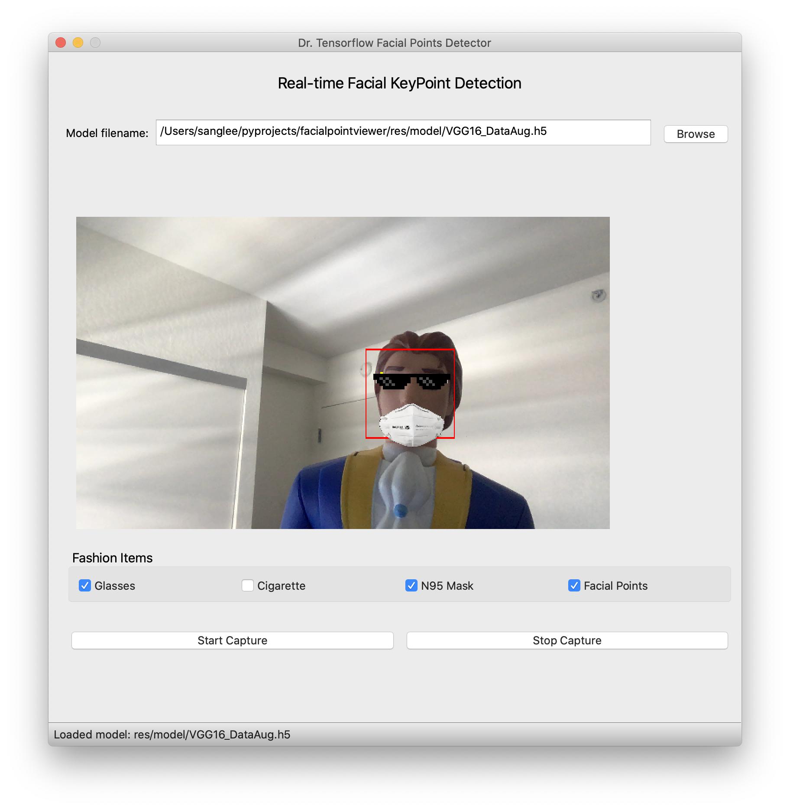

# Real-time facial keypoint detection using CNN

This github repo contains the source code for the real-time facial point detection application using VGG-16 network. [Kaggle dataset](https://www.kaggle.com/c/facial-keypoints-detection/) for facial keypoints detection has been used to train the network. Two real-time key point detection applications have been implemented using this application. These are (1) desktop application and (2) web application. This repo contains the source code for the desktop application. Please follow think link to see the live demo: https://drminix.github.io/projects/facialpointdetection/index.html

Desktop application is written in Python with QT5.
